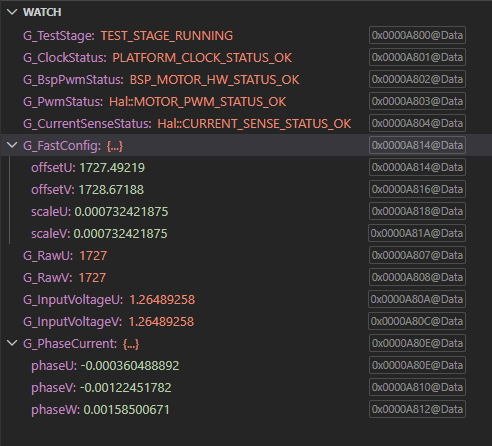
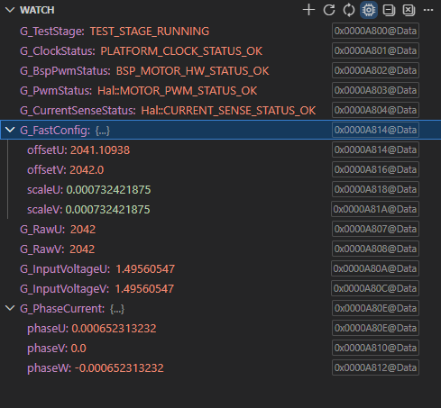

## Test Result Summary
After the test, I successfully validated that the current sense module calibration and measured phase current. But there was an issue during the test caused by the impedance difference with real application (inverter shunt resistor) and the test (potentiometer) explained below.

## Background

During LAUNCHXL-F28379D CurrentSense bench validation, both ADC inputs were
driven from the same potentiometer.

With an acquisition window of 15 SYSCLK cycles (75 ns), an externally
measured ~1.50 V input was converted as approximately 1.26 V.

Increasing the acquisition window to 100 SYSCLK cycles (500 ns) produced
approximately 1.49 V and matched the externally measured signal.

### 15-cycle acquisition result at 1.5V from potentiometer

### 100-cycle acquisition result at 1.5V from potentiometer

## Root Cause

The 15-cycle value is the minimum acquisition window used by the current
ADC configuration, but the potentiometer presents a higher source impedance
than the intended current-sense amplifier.

The ADC sample-and-hold capacitor therefore did not fully settle during the
short acquisition interval.

## Current Decision

This is not considered a production defect at this stage.

The 100-cycle value was used only to validate the bench setup and demonstrate
the effect of source impedance on ADC settling.

## Follow-up

When the actual inverter/current-sense front end is available:

- Validate ADC settling with the real current-sense amplifier output.
- Determine the minimum reliable acquisition window.
- Verify measurement accuracy across the expected current range.
- Update the production CurrentSense acquisition setting if required.

## Acceptance Criteria

The selected acquisition window shall provide stable and accurate ADC results
with the production current-sense front end without unnecessary sampling delay.