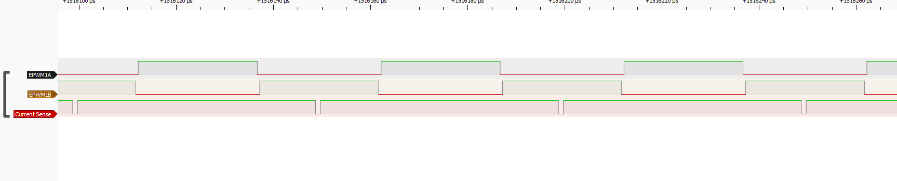
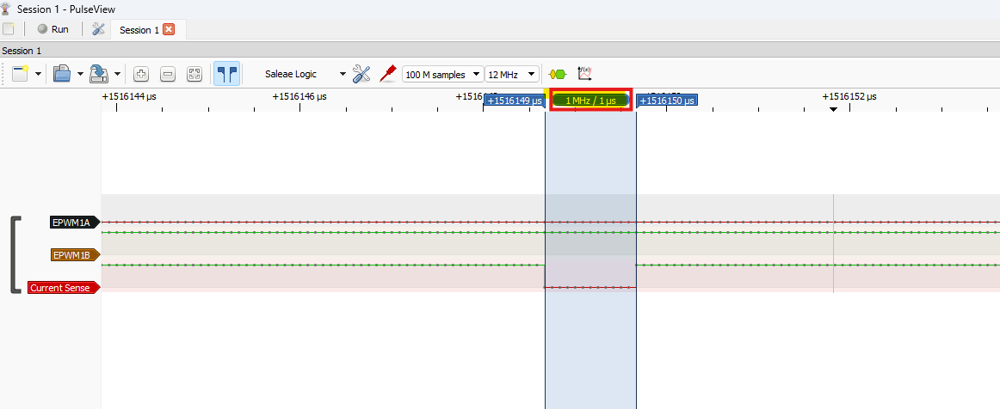

## PWM-Synchronized ADC Sampling Timing

### Objective

Verify that the CurrentSense ADC start-of-conversion trigger is synchronized
with the intended point of the center-aligned PWM cycle.

The CurrentSense implementation uses the EPWM1 PERIOD event to generate SOCA:

EPWM1 TBCTR = TBPRD -> SOCA -> ADC acquisition

### Test Method

EPWM4A was configured as a synchronized timing marker using the same
20 kHz center-aligned time base as EPWM1.

The marker was generated around the PERIOD event:

- PWM frequency: 20 kHz
- PWM period: 50 us
- EPWM clock: 100 MHz
- Marker compare point: TBPRD - 50 counts
- Marker LOW width: approximately 1 us

The center of the marker LOW pulse therefore represents:

TBCTR = TBPRD -> EPWM1 PERIOD -> SOCA

The following signals were captured with a logic analyzer:

- EPWM1A: motor PWM reference
- EPWM4A: ADC sampling timing marker

### Result

The EPWM4A timing marker was observed at the center of the EPWM1A LOW
interval.

This confirms that the ADC SOCA trigger is generated at the EPWM1 PERIOD
event as intended.

For the current complementary PWM configuration, the EPWM1A LOW interval
approximately corresponds to the EPWM1B low-side conduction interval.
Therefore, the selected trigger point is located near the center of the
low-side conduction window for this test condition.

### Acquisition Window

The temporary bench configuration uses an ADC acquisition window of
100 SYSCLK cycles.

With SYSCLK = 200 MHz:

100 cycles x 5 ns = 500 ns

The SOCA event starts the ADC acquisition window. The logic-analyzer marker
indicates the trigger instant; it does not directly indicate ADC
end-of-conversion timing.

### Conclusion

The PWM-to-ADC trigger timing path was validated successfully:

EPWM1 time base
-> PERIOD event
-> SOCA
-> ADC acquisition start

The test confirms deterministic synchronization between PWM generation and
ADC sampling.

### Production Follow-up

This validation confirms the timing infrastructure only. It does not yet
prove that the selected sampling instant is optimal for the final inverter.

When the production current-sense front end and inverter are available, the
sampling point shall be revalidated considering:

- actual low-side shunt conduction windows,
- PWM duty cycle and SVPWM sector,
- switching transients and dead time,
- current-sense amplifier settling time,
- ADC acquisition time.

The sampling point may be adjusted if the available valid-current window
becomes insufficient under real operating conditions.